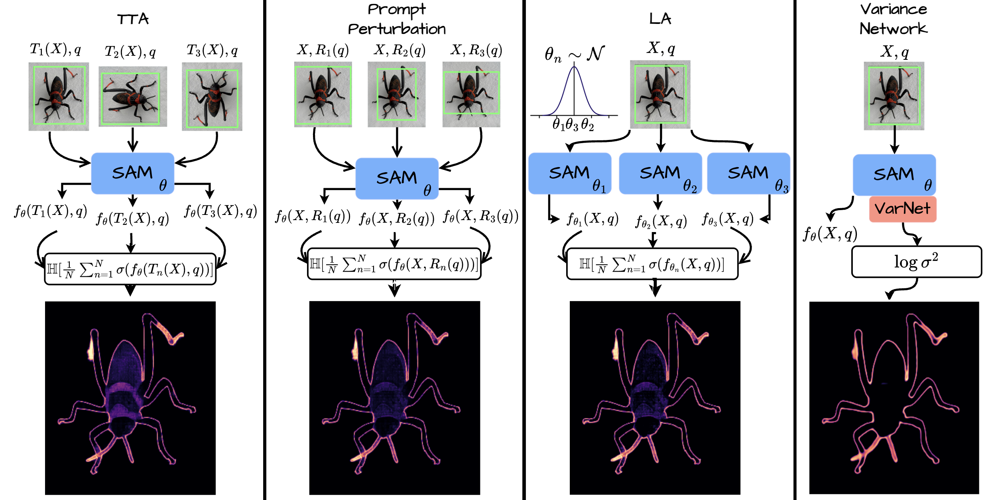
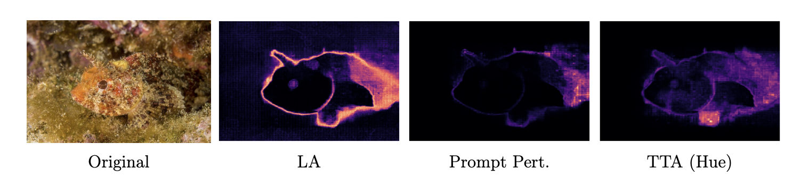
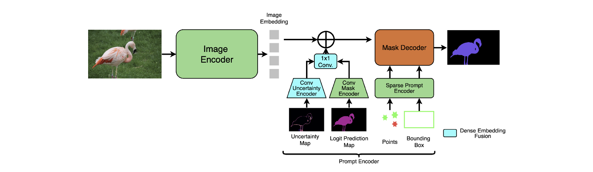

# UncertSAM: Uncertainty-Infused SAM

<p align="center">
  
  <br>
  <em>Figure 1: Overview of the uncertainty strategies integrated into SAM 2.</em>
</p>

<p align="center">
  <a></a>
  <a></a>
  <a href="https://huggingface.co/datasets/JesseBrouw/UncertSAM">
    
  </a>
</p>

This repository accompanies the paper **Towards Integrating Uncertainty for Domain-Agnostic Segmentation**. It hosts the UncertSAM benchmark and the training/evaluation code built around the `uncertsam2` package: a modular overlay that extends SAM 2 with uncertainty estimation and refinement.

---

## 🖼️ The UncertSAM Benchmark

<p align="center">
  
  <br>
  <em>Figure 2: Samples from the UncertSAM benchmark (23k+ images, 44k+ masks).</em>
</p>

<p align="center">
  <a href="https://huggingface.co/datasets/JesseBrouw/UncertSAM">
    
  </a>
</p>

We unify eight collections (BIG, COIFT, COD10K-v3, MSD Spleen, ISTD, SBU, Flare7K, Trans10K) that span fine-grained saliency, camouflage, medical imagery, shadows, lighting artifacts, and transparent objects. The benchmark consists of 23k+ images with 44k+ instance masks.

---

## 🧠 Methodology

We investigate four post-hoc strategies that manipulate SAM’s lightweight prompt and decoder modules while freezing the image encoder:

1. **Test-Time Augmentations (TTA):** Perturb the input image and aggregate predictions.
2. **Prompt Perturbations:** Sample and jitter bounding boxes / points to estimate uncertainty.
3. **Last-layer Laplace Approximation:** Use `laplace-torch` to approximate the posterior of the last-layer decoder weights.
4. **Variance Network:** Train an auxiliary heteroscedastic log-variance head.

<p align="center">
  
  <br>
  <em>Figure 3: Example outputs across uncertainty estimation strategies.</em>
</p>

In addition, **Dense Embedding Fusion** leverages the uncertainty maps during refinement.

<p align="center">
  
  <br>
  <em>Figure 4: Dense Embedding Fusion uses uncertainty maps to refine the mask.</em>
</p>

---

## 📚 Citation

Found this work useful? Give it a shout-out:

```bibtex
@inproceedings{brouwers2025towards,
    title     = {Towards Integrating Uncertainty for Domain-Agnostic Segmentation},
    author    = {Brouwers, Jesse and Xing, Xiaoyan and Timans, Alexander},
    booktitle = {NeurIPS 2025 Workshop on Frontiers in Probabilistic Inference},
    year      = {2025}
}
```

---

## 📄 License

- `Code:` This repository is licensed under the AGPL-3.0.
- `UncertSAM Benchmark:` The benchmark aggregates multiple datasets (BIG, COD10K, etc.), each with its own license. Please refer to the HuggingFace Dataset Card, or the appendix in the paper, for the specific terms of use for each subset.
- Files derived from SAM 2 retain their original license headers and are governed by the SAM 2 license where applicable.

---

## 🙏 Acknowledgements

Supported financially by **Robert Bosch GmbH**.

---

## 🗂️ Repository Overview

- `src/cli`: Hydra entry points (e.g., `python -m src.cli.eval`) that coordinate datasets, transforms, and model construction.
- `src/uncertsam2`: The UncertainSAM2 overlay (modeling, Laplace-aware mask decoders, evaluation utilities, visualization helpers).
- `src/uncertainty`: Laplace, prompt-perturbation, and refinement mixins.
- `configs`: Hydra defaults. Use `local_config.yaml` for local runs, and `configs/experiment/**` for task-specific overrides.
- `scripts/local`: Environment bootstrapping plus ready-to-edit job scripts.
- `utils`: Dataset download.

---

## 🛠 Environment Setup

### Python environment

```bash
python3 -m venv .venv
source .venv/bin/activate
pip install -U pip
pip install -r requirements.txt
```

- Local helper: `source scripts/local/setup_env.sh` (activates `.venv`, exports `DATA_DIR`/`HF_HOME`, loads `configs/.secrets` if present).

### Hydra configs & env vars

- `local_config.yaml`: logs to `logs/hydra_logs/<experiment>/<timestamp>` relative to the repo root.
- `configs/checkpoint_mapping/*.yaml`: map logical model names (e.g., `SAM2_large`) to `[<config_yaml>, </path/to/checkpoint.pt>]`.
- Required env vars:
  - `DATA_DIR`: folder that stores `UncertSAMBenchmark/` and SA-1B subsets.
  - `HF_HOME`: HuggingFace cache.
  - `HF_TOKEN`: HuggingFace token needed by the benchmarking scripts (export it or store it inside `configs/.secrets`).

### Quick test

Use the lightweight local run to make sure the environment is wired correctly:

```bash
bash scripts/local/run_eval.sh
```

It launches `python -m src.cli.eval --config-name local_config experiment=uncertainty-quantification/eval/sam2_tiny` and writes metrics/qualitative examples inside `logs/hydra_logs/...`.

---

## 📥 Data and Checkpoints

### Download the benchmark

```bash
export HF_TOKEN=hf_xxx
python -m utils.download_dataset --cache_dir=$DATA_DIR/UncertSAMBenchmark
```

### Download SAM2 checkpoints

```bash
sbatch scripts/local/download_checkpoints.sh
```

Update `configs/checkpoint_mapping/*.yaml` accordingly.

---

## 🚀 Running Experiments

```bash
python -m src.cli.eval \
  --config-name local_config \
  experiment=uncertainty-quantification/eval/sam_baseline \
  data_dir=$DATA_DIR/UncertSAMBenchmark
```

Hydra writes metrics CSVs and qualitative plots to the configured run directory.

### Baseline SAM2 evaluation

```bash
python -m src.cli.eval \
  --config-name local_config \
  experiment=uncertainty-quantification/eval/sam_baseline \
  data_dir=$DATA_DIR/UncertSAMBenchmark
```

Outputs: per-dataset CSVs plus `examples/<dataset>/` with qualitative figures.

### Fit the Laplace approximation

```bash
python -m src.laplace_approximation \
  --config-name local_config \
  experiment=uncertainty-quantification/training-fitting/laplace \
  data_dir=$DATA_DIR/UncertSAMBenchmark
```

Artifacts (under the Hydra log dir):

- `laplace_state_dict.pth`
- `model_weights_state_dict.pth`

### Train the variance network

```bash
python -m src.variance_network \
  --config-name local_config \
  experiment=uncertainty-quantification/training-fitting/variance_network \
  data_dir=$DATA_DIR/UncertSAMBenchmark
```

Lightning saves `best-checkpoint.ckpt`, which you feed into the evaluation configs below.

---

### 📊 Evaluate uncertainty methods

- **Laplace**

  ```bash
  python -m src.cli.eval \
    --config-name local_config \
    experiment=uncertainty-quantification/eval/laplace \
    experiment.laplace_checkpoint=/abs/path/to/laplace_state_dict.pth \
    data_dir=$DATA_DIR/UncertSAMBenchmark
  ```

- **Variance network**

  ```bash
  python -m src.cli.eval \
    --config-name local_config \
    experiment=uncertainty-quantification/eval/variance_network \
    experiment.variance_network_checkpoint=/abs/path/to/best-checkpoint.ckpt \
    data_dir=$DATA_DIR/UncertSAMBenchmark
  ```

- **Prompt perturbation / TTA**

  ```bash
  python -m src.cli.eval \
    --config-name local_config \
    experiment=uncertainty-quantification/eval/prompt_perturbation \
    data_dir=$DATA_DIR/UncertSAMBenchmark

  python -m src.cli.eval \
    --config-name local_config \
    experiment=uncertainty-quantification/eval/TTA_hue \
    data_dir=$DATA_DIR/UncertSAMBenchmark
  ```

Swap in `TTA_train` or any other config under `configs/experiment/uncertainty-quantification/eval/` for different augmentations.

### Prompt tuning and dense refinement

```bash
python -m src.prompt_tuning \
  --config-name local_config \
  experiment=refinement/training-fitting/dense_laplace \
  experiment.laplace_checkpoint=/abs/path/to/laplace_state_dict.pth \
  data_dir=$DATA_DIR/UncertSAMBenchmark
```

Artifacts: `prompt_encoder.pth` (latest) and `prompt_encoder_best.pth` (best Lightning checkpoint).

Evaluate refinement strategies (dense Laplace example):

```bash
python -m src.cli.eval \
  --config-name local_config \
  experiment=refinement/eval/dense_laplace \
  experiment.laplace_checkpoint=/abs/path/to/laplace_state_dict.pth \
  experiment.uncertain_prompt_encoder_path=/abs/path/to/prompt_encoder_best.pth \
  data_dir=$DATA_DIR/UncertSAMBenchmark
```

Other configs under `configs/experiment/refinement/eval/` reproduce ablations such as the ones baseline or sparse prompt variants.
